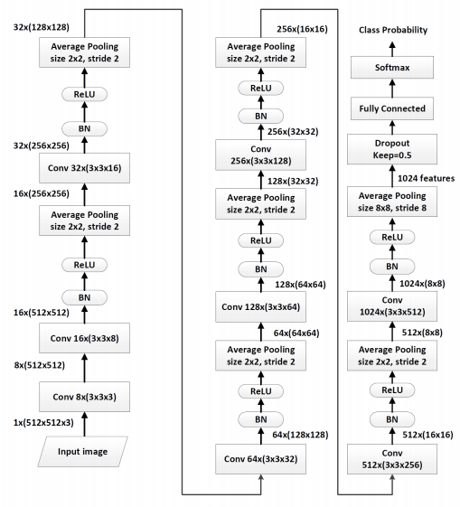
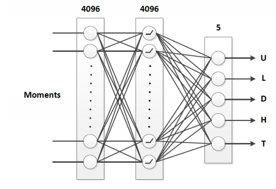

# Processing-History-of-Images
Our aim is to reproduce the results mentioned in the paper [Deep Learning for detecting Processing History of Images](https://pdfs.semanticscholar.org/23c5/9ffc8161ca2cc1758c137760563de29ef582.pdf).
We have used Pytorch for this implementation and have tried to stick to the CNN architecture used in the paper but have made certain tweaks to get better results.

## Architecture
The training proceeds in two phases, and thus two CNN's are used, whose architectures are as follows:
<div align="center">

<p align="center">
    <b><u> Model I </u></b>
</p>
</div>
<div align="center">

<p align="center">
    <b><u> Model II </u></b>
</p>
</div>


## Requirements
- python3.x
- latest version of Pytorch (you can follow any standard blog to install pytorch)
- numpy
- pickle
- virtualenv
- GPU with 10Gb or more memory(we used Nvidia 1080Ti for training)


## Instructions
- Generating dataset:
    - First of all, BossBase raw images need to be downloaded which are present [here](http://agents.fel.cvut.cz/stegodata/RAWs/).
    - Then, extract the tar files, create a folder **datasets/1.data** in the parent directory and copy the extracted images to this folder.
    - Next, open Matlab and run the commands `cr2jpeg` and then `loldata` within the **matlab** folder in the project. These commands might take quite some time.
    - After running these commands, the directory structure inside **dataset** folder will be as shown:
    ```
    .
    ├── jpegs
        ├── test
        |    |── ctr
        |    │    ├── denoise
        |    │    ├── high
        |    │    ├── low
        |    │    ├── org
        |    │    ├── tonal
        |    │
        |    |── mtr
        |         ├── denoise
        |         ├── high
        |         ├── low
        |         ├── org
        |         ├── tonal
        |       
        ├── train
        |    |── ctr
        |    │    ├── denoise
        |    │    ├── high
        |    │    ├── low
        |    │    ├── org
        |    │    ├── tonal
        |    │
        |    |── mtr
        |         ├── denoise
        |         ├── high
        |         ├── low
        |         ├── org
        |         ├── tonal        
        |        
        |
        |── val
             |── ctr
             │    ├── denoise
             │    ├── high
             │    ├── low
             │    ├── org
             │    ├── tonal
             │
             |── mtr
                  ├── denoise
                  ├── high
                  ├── low
                  ├── org
                  ├── tonal        
    ```

- Training the network for phase 1:
    - Setting up a vitual environment:
    ```bash
    $ virtualenv venv
    $ source venv/bin/activate
    ```
    - Installing dependencies - `pip install -r requirements.txt`.
    - Training the model for phase I - `python3.5 train_phase_1.py`.
    - Run `python3.5 test_phase_1.py` to test the network.

- Once the network 1 is done training, we use the network to extract moments for images of random sizes. Run the following commands sequentially.
```bash
$ python3.5 extract_train_moments.py
$ python3.5 extract_val_moments.py
$ python3.5 extract_test_moments.py
```

- Training second part of the network:
    - Run `python3.5 train_MLP_net.py` to train second phase.
    - Run `python3.5 test_MLP.py` to test the network of second phase.

- Final detector is a cascade of both the networks.

The accuracies and other parameters used while training the models are mentioned in detail in the [Report](Project-Report.pdf).

## Contributors
- Aniket Singh
- [Vishal Sharma](https://github.com/VishalCR7)
